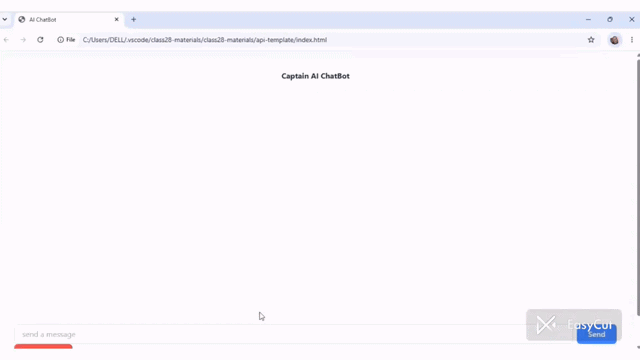
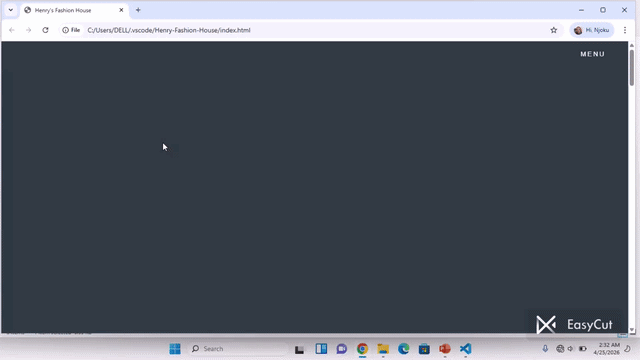
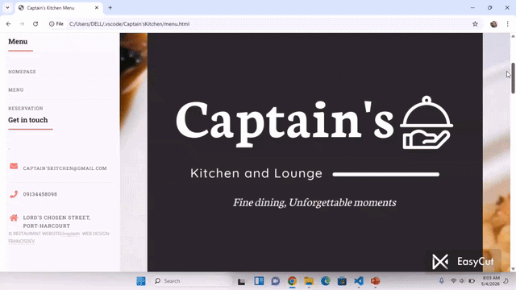

<h1 align="center">Hi 👋, I'm Njoku Francis</h1>
<h3 align="center">A passionate Full-stack Developer</h3>

  

  

  

- 🔭 My Project 

- 🌱 My Project 

- 👯 My Project 

- 🤝 My Project 

- 💬 Ask me about **HTML, CSS, Javascript, React, Node, OOP, MongoDB, Express**

- 📫 How to reach me **frannjoku200@gmail.com**

<h3 align="left">Connect with me:</h3>

<h3 align="left">Languages and Tools:</h3>

           

&nbsp;

